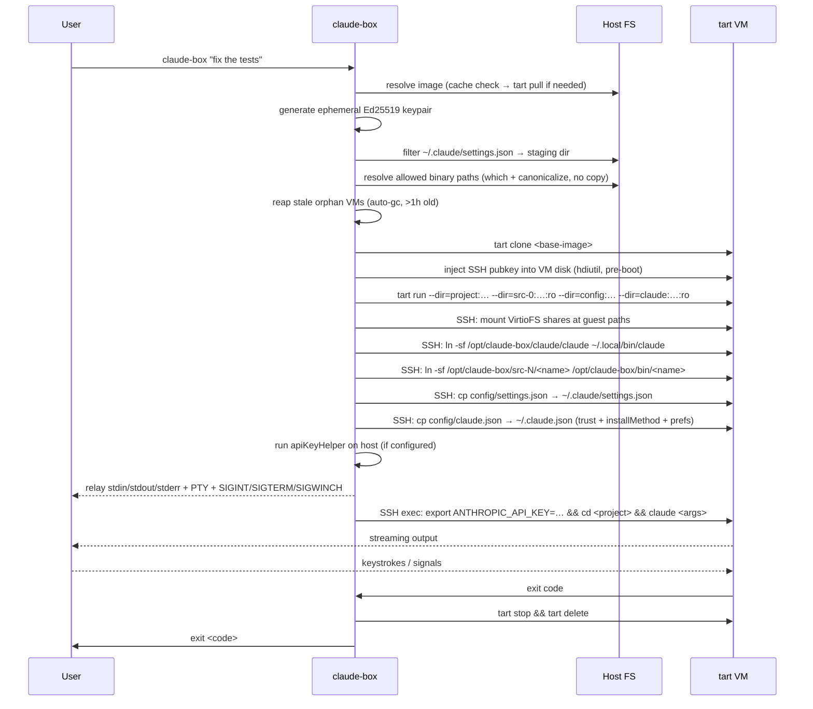

# claude-box

A macOS sandbox for [Claude Code](https://claude.ai/code) built in Rust. Wraps the `claude` CLI in an ephemeral [tart](https://github.com/cirruslabs/tart) macOS VM, giving each run an isolated environment with full Apple Silicon performance.

## How it works



All stdin/stdout/stderr is relayed transparently, including PTY allocation for interactive sessions, SIGINT/SIGTERM forwarding, and SIGWINCH terminal resize events.

## Requirements

- macOS (Apple Silicon)
- [tart](https://github.com/cirruslabs/tart) (`brew install cirruslabs/cli/tart`)
- Rust toolchain (`curl https://sh.rustup.rs | sh`)
- Claude Code installed on the host (the host binary is mounted into the VM — no guest installation needed)

## Install

```bash
./install.sh
```

The script builds the release binary, copies it to `~/.local/bin/`, and checks for dependencies (tart, claude). Override the install directory with `CLAUDE_BOX_INSTALL_DIR`.

Set your base image once:

```bash
export CLAUDE_BOX_IMAGE=ghcr.io/cirruslabs/macos-sequoia-base:latest
```

### Alias as `claude`

To use `claude-box` as a drop-in replacement for `claude`:

```bash
# Current session only
alias claude='claude-box'
```

To make it permanent, add to your shell profile:

```bash
echo 'alias claude="claude-box"' >> ~/.zshrc
source ~/.zshrc
```

Now `claude "fix the tests"` runs inside a sandbox automatically. If the sandbox fails, claude-box falls back to running claude directly on the host.

## Usage

```
claude-box [OPTIONS] [CLAUDE_ARGS...]
```

All flags not listed below are forwarded verbatim to `claude` inside the VM.

| Flag | Default | Description |
|------|---------|-------------|
| `--vm-image <IMAGE>` | `$CLAUDE_BOX_IMAGE` | OCI ref or path to a local `.ipsw` file |
| `--mount <PATH>` | current directory | Host directory to mount into the VM at the same absolute path |
| `--allow-tool <NAME>` | all | MCP server name to enable inside the VM (repeatable) |
| `--allow-binary <NAME>` | none | Host binary to forward into the VM (repeatable) |
| `--pull <POLICY>` | `missing` | When to pull the image: `always`, `missing`, `never` |
| `--persist` | false | Keep the VM after the run instead of deleting it |
| `--vm-name <NAME>` | `claude-box-<uuid>` | Explicit VM instance name |
| `--validate-image` | false | Smoke-boot the base image before cloning (~30s extra) |
| `--no-fallback` | false | Fail hard on sandbox errors instead of falling back to host claude |
| `--no-warm` | false | Disable warm pool; always cold-boot a fresh VM |

### Examples

```bash
# Basic run — mounts CWD, passes all args to claude
claude-box "fix the tests"

# Allow only specific MCP servers
claude-box --allow-tool filesystem --allow-tool github "review my PR"

# Forward host tools into the VM
claude-box --allow-binary gh --allow-binary jq "summarise open issues"

# Mount a specific project directory
claude-box --mount ~/projects/myapp "add unit tests"

# Keep the VM for inspection after the run
claude-box --persist --vm-name debug-session "debug the crash"

# Skip the pull on repeated runs (use local cache)
claude-box --pull=never "what changed since yesterday?"

# Force a fresh pull of the base image
claude-box --pull=always "run the full test suite"
```

## Warm pool

claude-box keeps one pre-suspended VM per base image so most runs skip the ~30s cold boot and resume from a snapshot in ~5-10s instead.

```bash
# List warm VMs and their age
claude-box warm list

# Force-rebuild the warm VM (e.g. after updating the base image)
claude-box warm refresh

# Delete all warm VMs and free their disk space
claude-box warm delete
```

The warm VM is rebuilt automatically after 7 days. It is also rebuilt on `warm refresh` or whenever the warm pool entry is missing or stale.

**Limitations:** The warm pool is disabled automatically when `--allow-binary` is used. Apple's Virtualization Framework snapshot/restore is only reliable with exactly 1 VirtioFS share; binary allowlists require additional shares. The warm VM's claude binary is baked into its disk at creation time, so `warm refresh` is needed after updating the host claude installation.

To always use a cold boot:

```bash
claude-box --no-warm "fix the tests"
```

## Garbage collection

Orphaned VMs (from crashes, SIGKILL, or host reboots) are automatically reaped at the start of each run — any `claude-box-*` VM older than 1 hour is stopped and deleted. For manual cleanup:

```bash
# List and delete all claude-box VMs
claude-box gc
```

## Image management

```bash
# List cached images
claude-box images list

# Pre-pull an image without running
claude-box images pull ghcr.io/cirruslabs/macos-sequoia-base:latest

# Remove an image from cache and tart's local store
claude-box images rm ghcr.io/cirruslabs/macos-sequoia-base:latest

# Remove all claude-box cached images
claude-box images prune
```

The image cache lives at `~/.cache/claude-box/images.json`. tart's own image store (at `~/.tart/`) is not touched by `prune` except via `tart delete`.

## Authentication

Claude inside the VM needs API credentials. claude-box supports three mechanisms, checked in order:

1. **`apiKeyHelper`** — If `~/.claude/settings.json` contains an `apiKeyHelper` field, the command is run on the **host** at exec time and its stdout is injected as `ANTHROPIC_API_KEY` in the guest. This is the recommended approach for environments that use credential helpers (e.g. internal tooling that mints short-lived API keys).

2. **`ANTHROPIC_API_KEY` env var** — If set in the host environment, forwarded directly to the guest.

3. **macOS Keychain (OAuth)** — If the host Claude CLI has been authenticated via OAuth (`claude login`), the API key stored in macOS Keychain (service `"Claude Code"`) is extracted and forwarded. This means OAuth users get VM authentication automatically with zero configuration.

If none of these sources produce a key, Claude will show its own authentication error.

The API key is injected only via the SSH exec command — it never touches guest disk, VirtioFS, or warm-pool snapshots.

### Host settings forwarding

claude-box copies the host's `~/.claude/settings.json` into the guest (with `apiKeyHelper` stripped, since it runs on the host). MCP server filtering via `--allow-tool` is applied before copying.

A subset of `~/.claude.json` (onboarding state, display preferences) is also forwarded so Claude doesn't prompt for first-run setup inside the VM. Keys matching `hasShown*`, `hasCompleted*`, `lastOnboardingVersion`, `showSpinnerTree`, and `customApiKeyResponses` are forwarded automatically — new notice keys added by future Claude CLI versions are picked up without code changes.

The project directory is pre-approved in the guest's `~/.claude.json` (`hasTrustDialogAccepted: true`) so Claude doesn't show the "Is this a project you trust?" prompt. A `~/.local/bin/claude` symlink and `installMethod: "system"` suppress the native-install warning.

Claude inside the VM always runs with `--dangerously-skip-permissions` since the VM itself is the sandbox — there's no need for a second permission layer. The "Bypass Permissions mode" warning is suppressed via `skipDangerousModePermissionPrompt: true` in the guest's `settings.json`.

## Security model

- **Explicit-allow only**: no binaries reach the VM unless named with `--allow-binary`.
- **MCP allowlist**: `--allow-tool` restricts which MCP servers are enabled inside the VM. With no `--allow-tool` flags all servers from `~/.claude/settings.json` (or `~/.claude.json`) are passed through.
- **Ephemeral SSH key**: a fresh Ed25519 keypair is generated per run and injected directly into the VM disk image before boot. The key is never written to disk on the host.
- **Ephemeral VM**: the VM is deleted after every run by default. Use `--persist` only for debugging.
- **Zero-copy binary forwarding**: allowed host binaries are never copied. Their source directories are mounted read-only as VirtioFS shares; a guest-side symlink farm at `/opt/claude-box/bin/` exposes only the named binaries on PATH. Sibling files in the same directory are accessible at their mount path but invisible to PATH.
- **Guaranteed cleanup**: a `VmGuard` ensures stop+delete runs on any failure after VM creation. An hdiutil `MountGuard` prevents leaked disk mounts during SSH key injection.
- **Orphan reaping**: automatic garbage collection of stale `claude-box-*` VMs at startup, plus `claude-box gc` for manual cleanup.
- **Defensive timeouts**: all tart CLI operations have timeouts (30s–600s, configurable via `CLAUDE_BOX_TART_TIMEOUT_SECS`). SSH connection uses exponential backoff with jitter.
- **Concurrent-safe cache**: image cache uses advisory file locking (`flock`) and atomic writes to prevent corruption from parallel runs.
- **Graceful fallback**: if the sandbox fails (tart missing, image pull error, VM won't boot), claude-box warns and falls back to running claude directly on the host. Use `--no-fallback` in CI to enforce sandboxing.

## Project layout

```
src/
├── main.rs         CLI entry point + subcommand dispatch
├── config.rs       SandboxConfig struct
├── sandbox.rs      Full lifecycle orchestration + VM cleanup guard
├── mount.rs        VirtioFS share builder
├── tools.rs        Claude config staging, MCP filter, binary resolution, apiKeyHelper
├── relay.rs        PTY/stdin/stdout/stderr/signal relay over SSH
├── images.rs       `claude-box images` subcommand handlers
├── gc.rs           Orphan VM reaper + `claude-box gc` subcommand
└── vm/
    ├── mod.rs          Vm trait + VmConfig
    ├── tart.rs         tart CLI wrapper
    ├── image.rs        Image resolution (OCI pull / IPSW import), pull policy
    ├── image_cache.rs  Local image cache manifest
    ├── ssh_key.rs      Ephemeral Ed25519 keypair + hdiutil disk injection
    ├── health.rs       get_vm_ip + wait_for_ssh
    ├── warm_pool.rs    Pre-suspended VM pool for fast startup
    └── guest_setup.rs  VirtioFS mount + config/settings copy over SSH
```

## Roadmap

| Milestone | Status | Description |
|-----------|--------|-------------|
| 1 — Scaffold | ✅ | Project structure, CLI flags, module stubs |
| 2 — VM Lifecycle | ✅ | tart clone/start/stop/delete, SSH key injection, VirtioFS mounts, guest setup |
| 3 — Tool Allowlist | ✅ | MCP config injection + filtering, host binary staging, dylib handling |
| 4 — Stdio Relay | ✅ | Full PTY relay, stdin forwarding, SIGINT/SIGTERM/SIGWINCH |
| 5 — Image Management | ✅ | OCI pull progress, IPSW import idempotency, image cache, `images` subcommand |
| 6 — Zero-copy Binaries | ✅ | Host binary dirs mounted read-only; guest symlink farm enforces allowlist |
| 7 — Operational Hardening | ✅ | VM cleanup guard, orphan reaper/gc, hdiutil mount guard, cache locking, SSH backoff, tart timeouts |
| 8 — Integration Tests | ✅ | Shared VM test harness, exec_capture, full pipeline tests (SSH, VirtioFS, symlink farm, exit codes) |
| 9 — Performance | ✅ | SSH backoff tuning (200ms base), deduplicated tart list calls; cold boot: ~11s SSH-ready |
| 10 — Warm Pool | ✅ | Pre-suspended VM per image; resume from snapshot in ~5-10s vs ~30s cold boot |
| 11 — Authentication | ✅ | apiKeyHelper on host, ANTHROPIC_API_KEY forwarding, full settings + onboarding state injection |
| 12 — Guest Polish | ✅ | Suppress all TUI warnings (trust prompt, installMethod, bypass-mode, custom API key), pattern-based `~/.claude.json` forwarding, e2e diagnostic + TUI capture test |
