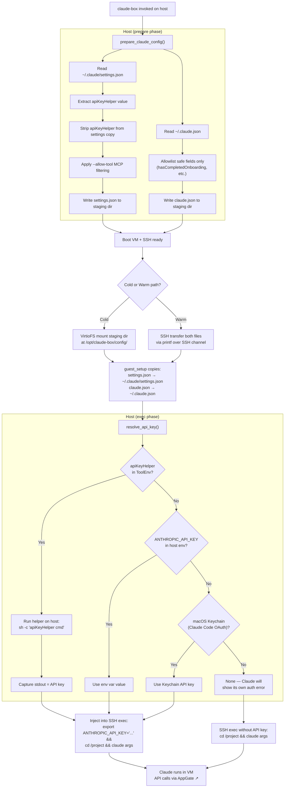

# Milestone 11 — VM Authentication & Settings

## Problem

Three issues prevent Claude from working inside the VM:

1. **No auth credentials** — The guest has no `ANTHROPIC_API_KEY`. The host authenticates via OAuth (tokens stored in Keychain, not in files), so we need `apiKeyHelper` to produce an API key on the host, then inject it into the guest via env var.

2. **Settings too narrow** — Only MCP `mcpServers` from `~/.claude/settings.json` are copied to the guest. Other settings (permissions, env vars, hooks) are lost.

3. **No `~/.claude.json`** — This file tracks onboarding state (`hasCompletedOnboarding`, model notices, display prefs). Without it, Claude runs first-time setup on every VM launch.

Network egress goes through AppGate at the host OS level — no guest-side setup needed.

## Auth Flow



## Design

### A. Settings injection — always copy full settings

Change `prepare_mcp_config()` → `prepare_claude_config()`. It always creates a staging dir with two files:

**`settings.json`** — full copy of host `~/.claude/settings.json`:
- Apply MCP filtering (`--allow-tool`) as before
- Strip `apiKeyHelper` (it runs on host, not guest; value saved for later use)
- Everything else passes through (permissions, env, hooks, etc.)

**`claude.json`** — allowlisted fields from host `~/.claude.json`:
```rust
const FORWARD_KEYS: &[&str] = &[
    "hasCompletedOnboarding",
    "lastOnboardingVersion",
    "hasShownOpus45Notice",
    "hasShownOpus46Notice",
    "showSpinnerTree",
];
```

Only safe, non-sensitive fields. No tokens, no OAuth, no statistics, no host paths.

### B. Auth — 3-source fallback chain

`resolve_api_key()` reads the extracted helper path from `ToolEnv` (populated during
config preparation — avoids re-reading settings.json).

Fallback chain: `apiKeyHelper` → `ANTHROPIC_API_KEY` env var → macOS Keychain → `None` (Claude shows its own auth error).

The Keychain lookup uses `security find-generic-password -s "Claude Code" -a <USER> -w` to extract the OAuth-minted API key that `claude login` stores. The key is validated (`sk-` prefix check) before use.

### C. Guest setup — copy both files

`guest_setup::setup_guest` copies both files from the config mount/SSH transfer:
- `settings.json` → `~/.claude/settings.json`
- `claude.json` → `~/.claude.json` (note: different location — home dir, not `.claude/`)

## Security Notes

- Credentials are **only in the SSH exec command string**, never written to guest
  disk, VirtioFS, or the warm-pool snapshot
- SSH channel is encrypted; the command string is not visible to tart/VzF
- `shell_escape` applied to all injected values to prevent injection
- The helper runs as the host user with full host credentials — this is intentional
- `~/.claude.json` forwarding uses an allowlist — only safe, non-sensitive fields

## Files Changed

| File | Change |
|------|--------|
| `src/tools.rs` | Rename `prepare_mcp_config` → `prepare_claude_config`. Always create staging dir. Add `claude.json` generation. Strip `apiKeyHelper` from settings, store in `ToolEnv`. Remove standalone `read_api_key_helper()`. |
| `src/tools.rs` | `ToolEnv`: add `api_key_helper: Option<String>` field |
| `src/sandbox.rs` | `resolve_api_key`: 3-source fallback (apiKeyHelper → env var → Keychain). `read_keychain_api_key()` added. |
| `src/sandbox.rs` | `run_warm`: SSH-transfer `claude.json` alongside `settings.json` |
| `src/vm/guest_setup.rs` | Copy `claude.json` → `~/.claude.json` when config mount present |
| `tests/tools_test.rs` | Update tests for renamed function and new staging dir behavior |

## Implementation Steps

1. **`ToolEnv` + `prepare_claude_config`** — refactor config preparation:
   - Always create staging dir (even if settings.json not found — still write claude.json)
   - Read full settings.json, extract+strip `apiKeyHelper`, apply MCP filter, write to staging
   - Read `~/.claude.json`, allowlist fields, write `claude.json` to staging
   - Store `api_key_helper: Option<String>` in `ToolEnv`

2. **`guest_setup.rs`** — add copy of `claude.json` → `~/.claude.json`

3. **`sandbox.rs`** — `resolve_api_key` takes `&ToolEnv` instead of calling `read_api_key_helper()`. `run_warm` transfers `claude.json` via SSH too.

4. **Remove `read_api_key_helper()`** — no longer needed.

5. **Fix tests** — update `tools_test.rs` for new function names and staging dir always existing.

## Running

User configures in `~/.claude/settings.json`:

```json
{
  "apiKeyHelper": "/opt/homebrew/bin/ddtool auth token anthropic-api"
}
```

Then `claude-box` picks it up automatically on every invocation.

## Verification

```bash
cargo build && cargo clippy -- -D warnings && cargo test
```

Manual: `claude-box -- --print "hello"` — should not prompt for onboarding/display setup.
With `apiKeyHelper` configured in `~/.claude/settings.json` — should authenticate and produce output.
